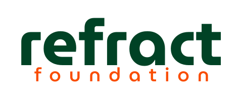

# The Refract Foundation Site
This repository holds the source code for Refract's public website.

The site features:
- Information about our mission
- Events we've run in the past
- Our upcoming campaigns and programs

This entire site was developed using static HTML and CSS.